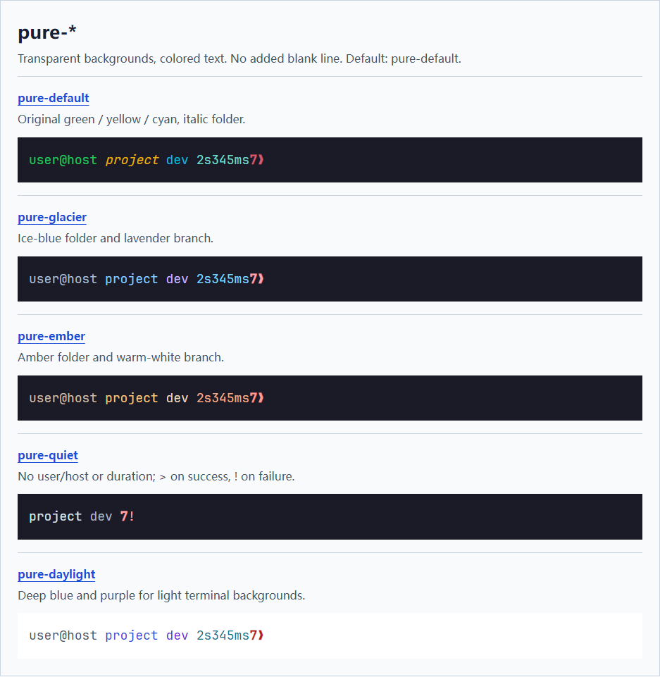
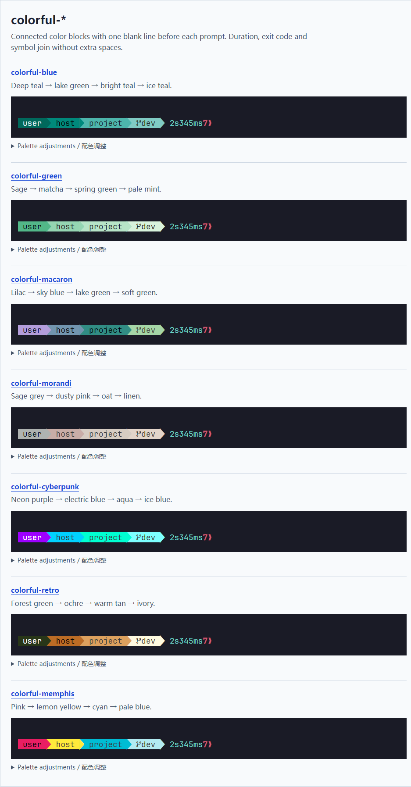

# unixify-powershell

为 **Windows 上的 PowerShell 7** 提供原生 Unix 风格提示符、路径、命令和 Tab 补全。

提示符形如：

```text
ityme@win project dev ❯
```

路径只显示当前文件夹名，用户主目录显示 `~`，非 Git 仓库省略分支。颜色和 `❯` 按 Starship 样式参考：失败时显示红色数字错误码，耗时达到 2 秒时显示执行时间。原生提示符优先读取当前目录的 `.git/HEAD`，在子目录和 worktree 中交给 Git 定位，不运行 Starship。

[English](README.md)

用 `/c/Users`、`~/projects` 表示路径，用 `ls`、`cp -r`、`grep` 等熟悉的命令操作文件，Tab 也补全为正斜杠路径。语法和管道仍使用 PowerShell。

| 操作 | 原生 PowerShell | 使用 unixify-powershell |
| --- | --- | --- |
| 切换目录 | `cd I:\ispace` | `cd /i/ispace` |
| 列出文件 | `Get-ChildItem` | `ls` / `ll`（通过 eza） |
| 复制目录 | `Copy-Item -Recurse src backup` | `cp -r src backup` |
| 搜索文件内容 | `Select-String error app.log` | `grep error app.log` |
| Tab 补全路径 | `I:\ispace\project\` | `/i/ispace/project/` |

## 安装

在 PowerShell 7（`pwsh`）中执行：

```powershell
irm https://raw.githubusercontent.com/ityme/unixify-powershell/main/src/script/install.ps1 | iex
```

安装位置为 `~/.config/upwsh`，会把 `upwsh` 加入 Path，在当前 pwsh 中定义 `upwsh` 命令，并加载 profile。若缺少 `eza`、`dust` 或 `btm`，安装结束会提示：

```text
missing  eza dust btm
install  upwsh tool install eza dust btm
```

## 使用路径

交互输入时，用小写盘符前缀和正斜杠表示路径：

```powershell
cd /i/ispace
cd ~/Desktop
cd -                         # 返回上一个目录
```

独立、未加引号的 `/c/...`、`~/...` 参数会在执行前转为 Windows 路径。引号内的文本保持原样，例如 `'use /c/demo'` 不会被改写。

含空格的路径、变量或脚本中的路径，用 `winpath` 显式转换；反向转换用 `unixpath`：

```powershell
winpath '/c/my work'          # C:/my work
unixpath 'C:\my work'         # /c/my work
cd (winpath '~/my work')
'C:\one', 'D:\two' | unixpath
```

两条命令都支持多个路径和管道输入，不要求路径存在。Tab 遇到需要引号的 Unix 绝对路径时，会生成 `(winpath '…')`。注释、内嵌脚本、重定向和 `--output=/c/a` 这类组合参数不会自动转换。

## Git 补全

Git 在 Path 上时，按 Tab 补全常用子命令、分支、标签和已配置的远程名称：

```text
git sw<Tab>                  → git switch
git switch fe<Tab>           → 匹配的本地分支
git checkout v<Tab>          → 匹配的标签及其他引用
git push o<Tab>              → origin
git pull origin <Tab>        → 本地已知的 origin 分支
git checkout -- ./<Tab>      → 文件
```

Git 单词唯一匹配时，补全后自动加空格。每段都只有一个匹配时，可以连续输入 `git pul<Tab>o<Tab>d<Tab>`，不用手敲空格；多个候选的公共前缀和目录补全不加空格。

只读取本地 Git 数据，不联网、不需要额外依赖。支持 `git -C <目录>` 和 `git switch --track`，其他复杂写法回退到普通补全。查询结果缓存 1 秒，输入实际命令时清空；其他终端的改动可能延迟约 1 秒显示。

## 提示符刷新

提示符显示上次命令结束时的状态快照。空回车、注释、Ctrl+L、Tab 和编辑时按 Ctrl+C 都复用它；实际命令完成、失败或被中断后刷新一次。目录或窗口宽度变化也会刷新。

另一个窗口在同一工作目录切换分支等外部改动，会在本窗口执行下一条命令后显示。执行 `git status` 即可检查仓库并刷新提示符。

## 管理安装

| 命令 | 作用 |
| --- | --- |
| `upwsh install` | 安装或修复文件、Path 和 `upwsh` 命令，然后 load |
| `upwsh update` | 更新已有安装，保留工具、`user-settings.ps1`、额外主题 JSON 和 profile 钩子 |
| `upwsh load` | 启用启动时自动加载，并加载当前 pwsh |
| `upwsh unload` | 停止自动加载，并恢复当前会话的默认提示符 |
| `upwsh uninstall` | 先 unload，再删除安装及项目添加的环境变量和 Path 项 |

仓库内的 `upwsh install` / `upwsh update` 默认 `--local`。`irm | iex` 默认 `--remote`。安装会加载当前窗口；卸载会先 unload，再删除运行时。

安装目录固定为 `~/.config/upwsh`，`UPWSH_HOME` 记录这个位置。原生提示符由 `src/lib/prompt.psm1` 提供，会随当前文件夹和 Git 分支变化。命令帮助见 `upwsh --help`。

## CLI 工具

按需安装到 `~/.config/upwsh/tool/bin`：

```powershell
upwsh tool list
upwsh tool install eza rg fd fzf
upwsh tool update eza
upwsh tool update --all
upwsh tool uninstall rg
```

## 主题

两个系列，共 12 套本地主题。默认 **`pure-classic`**（原 iWonder）。切换无需重启 pwsh：

```powershell
upwsh theme list
upwsh theme use "colorful-blue"
upwsh theme use "pure-classic"
```

### pure-* · 透明背景



| 主题 | 外观 |
| --- | --- |
| [pure-classic](src/theme/pure-classic.json) | 原有绿色用户/主机、黄色斜体目录、青色分支 |
| [pure-glacier](src/theme/pure-glacier.json) | 冰蓝目录、淡紫分支 |
| [pure-ember](src/theme/pure-ember.json) | 琥珀目录、暖白分支 |
| [pure-quiet](src/theme/pure-quiet.json) | 极简，隐藏用户/主机和耗时；成功 `>`，失败 `!` |
| [pure-daylight](src/theme/pure-daylight.json) | 深蓝目录、深紫分支，适合浅色终端背景 |

### colorful-* · 连续色块



| 主题 | 配色顺序 |
| --- | --- |
| [colorful-blue](src/theme/colorful-blue.json) | 深青 → 湖绿 → 亮青 → 冰青 |
| [colorful-green](src/theme/colorful-green.json) | 鼠尾草绿 → 抹茶绿 → 春芽绿 → 极地薄荷 |
| [colorful-macaron](src/theme/colorful-macaron.json) | 香芋紫 → 天空蓝 → 湖水绿 → 嫩芽绿 |
| [colorful-morandi](src/theme/colorful-morandi.json) | 豆沙灰 → 灰粉 → 燕麦 → 亚麻 |
| [colorful-cyberpunk](src/theme/colorful-cyberpunk.json) | 霓虹紫 → 极光蓝 → 荧光绿 → 冰蓝 |
| [colorful-retro](src/theme/colorful-retro.json) | 森林暗绿 → 砖赭 → 暖棕 → 象牙白 |
| [colorful-memphis](src/theme/colorful-memphis.json) | 亮粉 → 柠檬黄 → 青绿 → 极浅蓝 |

Colorful 按已确认的 `starship-colorful.toml` 配色制作。用户、主机、目录、Git 使用连续色块和实心三角，耗时、返回码与 `❯` 保持透明背景。非仓库、短耗时或成功时，相应模块隐藏，不留下多余箭头。文字对比调整记录在各 JSON 的 `_Comment.ContrastAdjustments` 中。

Colorful 在提示符前留一空行（`AddNewline: true`），pure 默认关闭。Colorful 的色块后只留一个空格，耗时、返回码、提示字符与 pure 一样紧接，例如 ` 6s418ms1❯`。

预览使用示例用户/主机、分支 `dev`、失败码 `7` 和耗时 `2.345s`；Quiet 隐藏耗时。深色预览背景为 `#1a1b26`，Daylight 为白色。选择主题不会更改终端整体背景。**Colorful 需要含 Powerline 字形的字体**，例如 JetBrainsMono Nerd Font。

想像预览页一样切换八种命令状态，下载仓库后用浏览器打开 **[docs/themes.html](docs/themes.html)**，无需联网或启动服务。GitHub 可能显示 HTML 源码，不直接运行页面。

所有提示符主题都在 `~/.config/upwsh/theme/`，`theme.json` 记录选择。复制一份内置 JSON、改名后再改。v2 用 `Order`、`Modules` 配置颜色、排列和连接符，每份 JSON 都有中文字段说明。切换后下一次提示符生效；编辑后需重新选择同一主题。

更新会刷新 `theme/` 下的随包文件名，其它 JSON 和 `theme.json` 留下。旧名称没有别名，也不会自动重命名。**不支持 v1 主题**，升级前先备份。升级步骤和配置方式见[主题说明](docs/themes.zh-CN.md)。

## 个人配置

编辑 `~/.config/upwsh/user-settings.ps1`，在内置别名之后加载。`upwsh update` 不会覆盖已有文件；卸载时随运行时一起删除。

```powershell
function global:work { cd (winpath '/i/my work') }
```

自带的 `w`、`t`、`i`、`d`、`gs` 写在 `user-settings.ps1`。终端上报也可写在同一文件。默认不发送完整命令文本，字段和隐私开关见[终端上报说明](docs/terminal-reporting.md)。

## 从源码安装

```powershell
git clone https://github.com/ityme/unixify-powershell.git
cd unixify-powershell
upwsh install
```

本项目内的 `upwsh install` / `upwsh update` 默认 `--local`。用 `--remote` 下载，或用 `--source`、`--ref`、`--repo` 指定来源。管道安装默认 `--remote`，并读取 `UPWSH_SOURCE`、`UPWSH_REF`、`UPWSH_REPO`。

测试、性能测量和路径转换接口维护见[开发说明](docs/development.md)。
